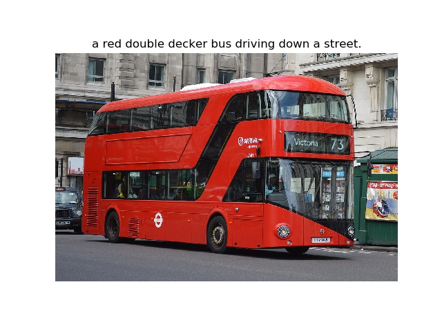

### Introduction
This neural system for image captioning is roughly based on the paper "Show and Tell: A Neural Image Caption Generatorn" by Vinayls et al. (ICML2015). The input is an image, and the output is a sentence describing the content of the image. It uses a convolutional neural network to extract visual features from the image, and uses a LSTM recurrent neural network to decode these features into a sentence. This project is implemented using the Tensorflow library, and allows end-to-end training of both CNN and RNN parts.

### Prerequisites
* **Tensorflow** ([instructions](https://www.tensorflow.org/install/))
* **NumPy** ([instructions](https://scipy.org/install.html))
* **OpenCV** ([instructions](https://pypi.python.org/pypi/opencv-python))
* **Natural Language Toolkit (NLTK)** ([instructions](http://www.nltk.org/install.html))
* **Pandas** ([instructions](https://scipy.org/install.html))
* **Matplotlib** ([instructions](https://scipy.org/install.html))
* **tqdm** ([instructions](https://pypi.python.org/pypi/tqdm))

### Usage
* **Preparation:** Download the COCO train2014 and val2014 data [here](http://cocodataset.org/#download). Put the COCO train2014 images in the folder `train/images`, and put the file `captions_train2014.json` in the folder `train`. Similarly, put the COCO val2014 images in the folder `val/images`, and put the file `captions_val2014.json` in the folder `val`. Furthermore, download the pretrained VGG16 net [here](https://ucsb.box.com/s/pj4gg3vpei57cf9xewttoqn01qqa3uj4)  if you want to use it to initialize the CNN part.

* **Training:**
To train a model using the COCO train2014 data, first setup various parameters in the file `config.py` and then run a command like this:
```shell
python3 main.py --phase=train \
    --load_cnn \
    --cnn_model_file='./vgg16_weights.npz'\
    [--train_cnn]
```
Turn on `--train_cnn` if you want to jointly train the CNN and RNN parts. Otherwise, only the RNN part is trained. The checkpoints will be saved in the folder `models`. If you want to resume the training from a checkpoint, run a command like this:
```shell
python3 main.py --phase=train \
    --load \
    --model_file='./models/xxxxxx.npy'\
    [--train_cnn]
```
To monitor the progress of training, run the following command:
```shell
tensorboard --logdir='./summary/'
```

* **Evaluation:**
To evaluate a trained model using the COCO val2014 data, run a command like this:
```shell
python3 main.py --phase=eval \
    --model_file='./models/xxxxxx.npy'
```
The result will be shown in stdout. Furthermore, the generated captions will be saved in the file `val/results.json`.

* **Inference:**
You can use the trained model to generate captions for any JPEG images! Put such images in the folder `test/images`, and run a command like this:
```shell
python3 main.py --phase=test \
    --model_file='./models/xxxxxx.npy'
```
The generated captions will be saved in the folder `test/results`.

### Results
A pretrained model with default configuration can be downloaded [here](https://ucsb.box.com/s/vqcxockfzoxfqltrg4l619x1cfvnskog). This model was trained solely on the COCO train2014 data. It achieves the following BLEU scores on the COCO val2014 data :
* **BLEU-1 = 62.9%**
* **BLEU-2 = 43.6%**
* **BLEU-3 = 29.0%**
* **BLEU-4 = 19.3%**

Here are some captions generated by this model:


### References
* [Show and Tell: A Neural Image Caption Generator](https://arxiv.org/pdf/1411.4555.pdf).By Oriol Vinyals, Alexander Toshev, Samy Bengio, Dumitru Erhan ICML 2015.
* [Adapted from earlier implementation in Tensorflow](https://github.com/DeepRNN/image_captioning)
* [Microsoft COCO dataset](http://mscoco.org/)